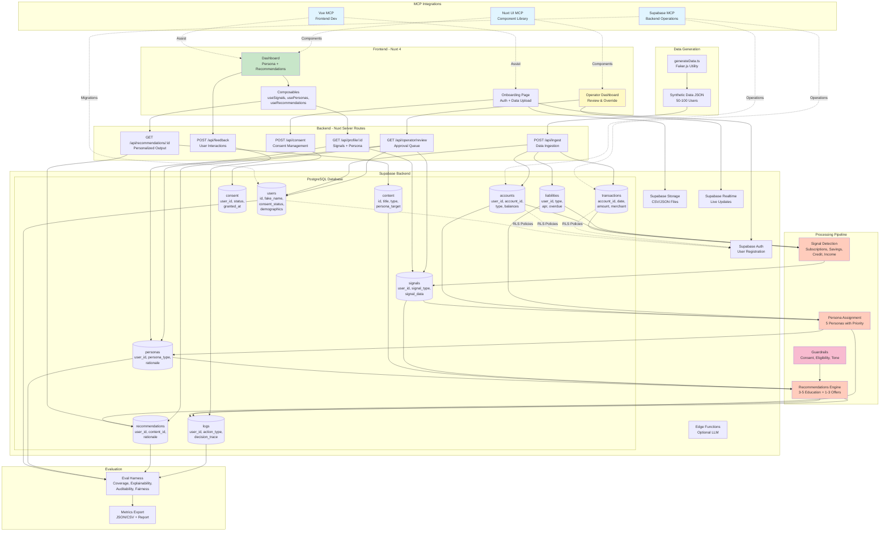
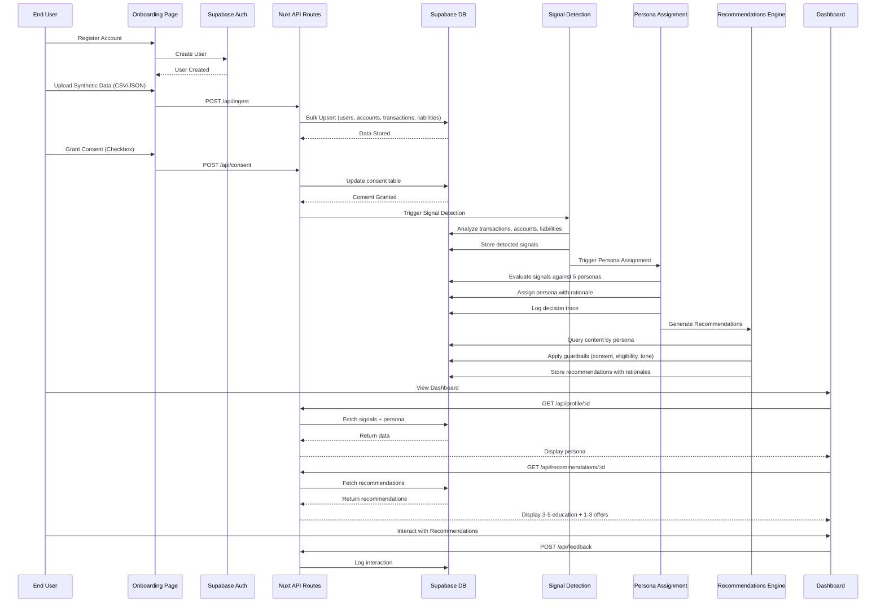
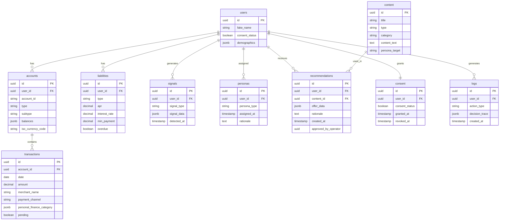
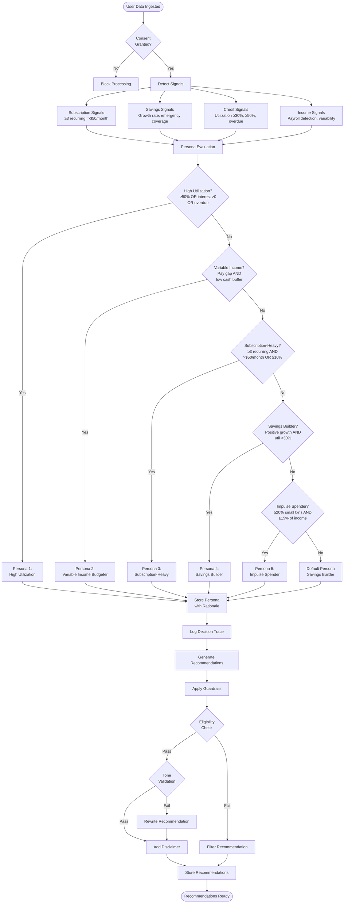
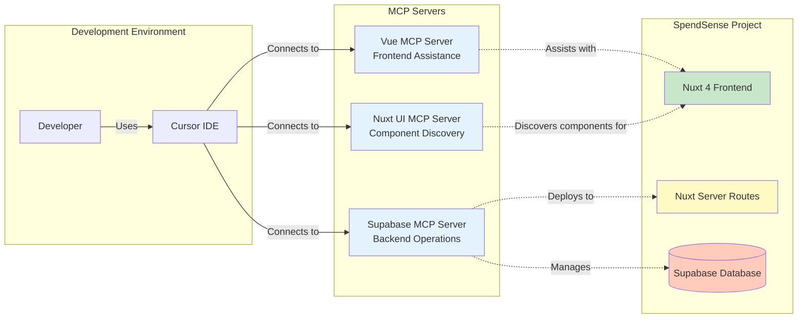

# SpendSense Architecture Diagrams

## System Architecture & Data Flow

## User Journey Flow

## Database Schema Relationships

## Persona Assignment Logic Flow

## MCP Integration Architecture

